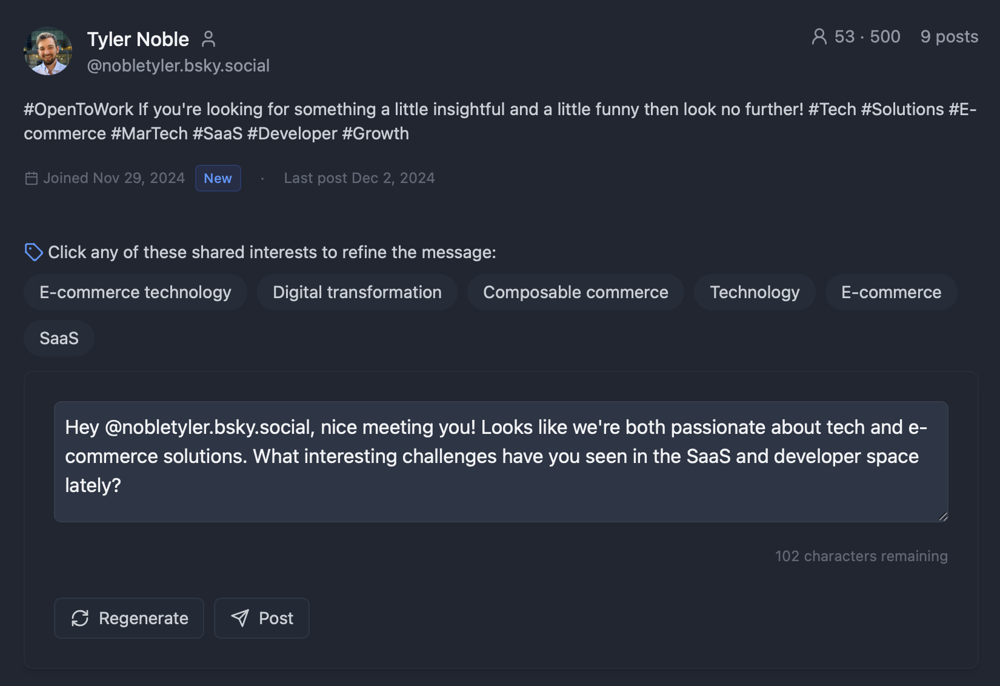
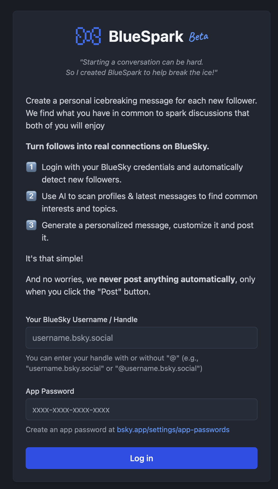

<div align="center">
  
  <h1>BlueSpark</h1>
  <p><strong>AI-powered conversation starter generator for BlueSky followers</strong></p>
</div>

BlueSpark is a web application designed to enhance engagement on BlueSky by automatically generating personalized conversation starters for new followers. The app analyzes both user and follower profiles to create meaningful, context-aware welcome messages that spark genuine conversations based on shared interests.

This tool does **NOT** post anything automatically, only when you click the "Post" button. I suggest that even with these generated messages, you still review and personalize them.



## Features ✨

- **BlueSky Authentication**: Secure login using BlueSky username and application password
- **Automated Profile Analysis**: 
  - Analyzes user's profile and last 200 posts
  - Fetches and analyzes the last 20 new followers
  - Processes each follower's profile and last 50 posts
  - Recent Interaction Detection, to prevent posting intro messages to users you've already interacted with
- **AI-Powered Message Generation**:
  - Creates personalized welcome messages using OpenRouter AI / Claude Haiku
  - Focuses on shared interests between user and follower
  - Includes engaging questions to start conversations
- **Message Management**:
  - Option to regenerate messages if desired
  - Direct posting to BlueSky with one click
  - Single message suggestion per user-follower pair



## Some neat little features 🎉

- a warning will show if you have @-mentioned this user in the past 2 weeks (or vice versa), to prevent accidentally posting a welcome message to someone you've already interacted with
  
- You can set the tone of voice and even add a custom instruction prompt for further customization
- You can  regenerate the message if you're not satisfied with it, the tool even provides common topics you can click to regenerate with focus on a specific topic.
- There is detection for "personal" vs "business" accounts (both on the user and followers side)
  - accounts are labeled as such (look for the person or building icon after the username)
  - messages are adjusted accordingly
  - the default tone of voice for personal accounts is "warm", while for business accounts it's "professional"
- It shows the amount of BlueSky API calls and AI tokens used
- New BlueSky users (defined as users with an account age < 14 days) get a "New" badge
  
- To save on API calls, the "topics in common" analysis and the message generation only takes place when you click the "Generate welcome message" button

## Installation 🚀

1. Clone the repository:
```bash
git clone [repository-url]
cd bluespark
```

2. Install dependencies:
```bash
npm install
```

3. Set up environment variables:
```bash
cp .env.example .env
```
Then edit the `.env` file and replace the placeholder values with your actual credentials:
- `VITE_OPENROUTER_API_KEY`: Your OpenRouter API key
- `VITE_OPENROUTER_MODEL`: The AI model to use (default: anthropic/claude-3.5-haiku-20241022)

## Development 💻

Start the development server:
```bash
npm run dev
```

Other available commands:
- `npm run build`: Build for production
- `npm run preview`: Preview production build
- `npm run lint`: Run ESLint

## Usage 📝

1. Log in with your BlueSky credentials (username and application password)
2. The app will automatically fetch your recent followers
3. For each follower, the app generates a personalized welcome message
4. You can:
   - Review the generated messages
   - Regenerate any message you're not satisfied with
   - Post approved messages directly to BlueSky

## Environment Variables ⚙️

The project uses environment variables for configuration. A `.env.example` file is provided as a template with all required variables:

```env
VITE_OPENROUTER_API_KEY=your_openrouter_api_key_here
VITE_OPENROUTER_MODEL=anthropic/claude-3.5-haiku-20241022
```

Copy this file to `.env` and replace the placeholder values with your actual credentials. The `.env` file is gitignored to keep your credentials secure.

## Contributing 🤝

1. Fork the repository
2. Create your feature branch (`git checkout -b feature/amazing-feature`)
3. Copy `.env.example` to `.env` and configure your environment variables
4. Commit your changes (`git commit -m 'Add some amazing feature'`)
5. Push to the branch (`git push origin feature/amazing-feature`)
6. Open a Pull Request

## License 📄

MIT License
